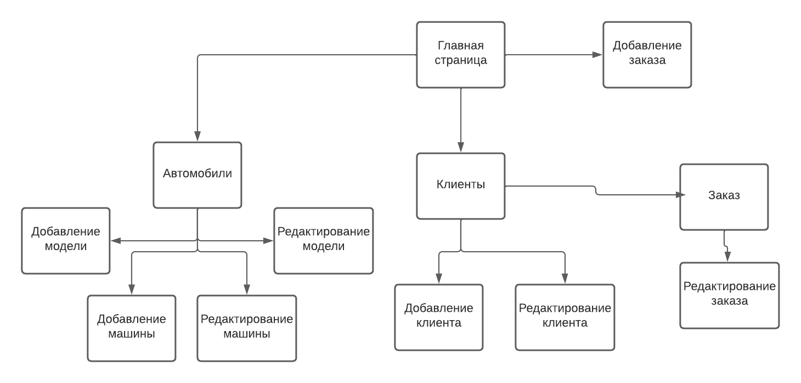

# javaweb_carshop

# Система учета автосалона
## База данных

## Страницы

### Главная страница
Краткая информация про салон и сслыки на страницы автомобилей, клиентов и заказов
Добавить заказ

### Автомобили
Поле для получения списка автомобилей/марок автомобилей по разным характеристикам, кнопка "Добавить марку\автомобиль", а так же возможность редактирования каждого элемента в списке.
#### Добавление марки автомобиля
Форма для добавления марки автомобиля.
#### Добавление автомобиля
Форма для добавления конкретного автомобиля.
#### Редактирование марки автомобиля
Форма для редактирования марки автомобиля.
#### Редактирование автомобиля
Форма для редактирования конкретного автомобиля.
### Клиенты 
Поле для получения списка клиентов по характеристикам их заказов, переход на страницу заказа и добавление/редактирование клиентов.
#### Добавление клиента
Форма для добавления клиента.
#### Редактирование клиента
Форма для редактирования/удаления клиента.
### Заказ
Просмотр информации о конкретном заказе, кнопка "редактировать заказ".
#### Редактирование заказа
Форма для редактирования заказа
### Добавление заказа
Форма для добавления заказа
